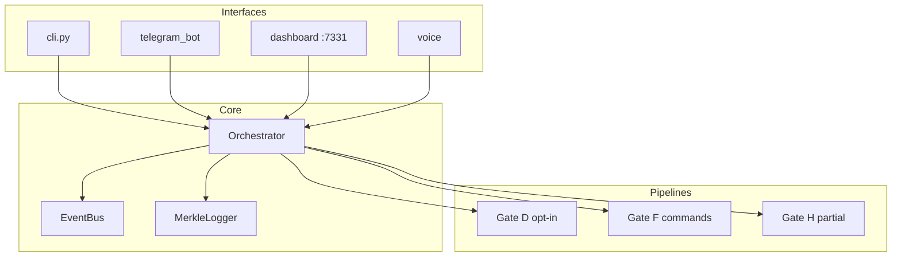

# Auditoría integral — Atlas Core

**Fecha:** 2026-05-25  
**Versión auditada:** `0.6.1` (tag `v0.6-gate-g`)  
**Auditor:** sesión Cursor (Fase A estática + Fase B ejecutable)  
**Fuente de verdad:** [AGENTS.md](../AGENTS.md), sellos `docs/gate_*_seal.md`

---

## 1. Resumen ejecutivo

| Eje | Puntuación | Veredicto |
|-----|------------|-----------|
| Arquitectura / Gates A–G | 9/10 | Diseño en capas coherente; Gate H en progreso |
| Seguridad | 7/10 | Controles fuertes; gaps en enforcement de permisos y `git` |
| Calidad / tests | 8/10 | 529 collected; 504 core sin browser; mypy verde tras fix QUAL-01 |
| CI/CD | 4/10 | Sin pipeline en repo (propuesta en `.github/workflows/ci.yml`) |
| Operaciones | 8/10 | Hermes + pipeline + inference smokes OK en host auditado |
| Documentación | 7/10 | Sellos sólidos; drift en conteos y FU-6 (corregido post-auditoría) |

**Conclusión:** Atlas Core es un runtime **local soberano** maduro para Gates C–G. Los riesgos prioritarios no son ausencia de controles, sino **desalineación entre política documentada y ejecución** (allowlist `git`, niveles CONFIRM/APPROVE, passphrase Telegram) y **regresión de calidad** (mypy rojo, tests browser sin Playwright).

**Orden de remediación recomendado:** SEC-01 → SEC-02 → QUAL-01 (mypy) → CI → FU-6 wiring → Gate H.

---

## 2. Verificación ejecutable (Fase B)

Comandos ejecutados en `/home/ronin/proyectos/atlas-core` con `.venv` activo y `.env` cargado.

| Check | Comando | Resultado |
|-------|---------|-----------|
| Suite completa | `PYTHONPATH=src pytest tests/ -q` | **513 passed, 16 failed** (40.45s) |
| Colección | `pytest tests/ --collect-only -q` | **529 tests** collected |
| mypy | `MYPYPATH=src mypy src/atlas/` | **2 errors** en Fase B inicial → **corregidos** (ver §10 QUAL-01) |
| Core pytest | `pytest --ignore=test_browser.py` | **504 passed** (28.49s) |
| Hermes smoke | `scripts/hermes_smoke.py` | **OK** (Tailscale VPS live) |
| Inference smoke | `scripts/inference_smoke.py` | **OK** (Groq + OpenRouter) |
| Pipeline smoke | `scripts/pipeline_smoke.py` | **OK** (5/5 intents) |
| Secretos en `src/` | grep patrones API keys | Solo en `pii_surrogate.py` (regex/docs) |
| `.env` en git | `git log --all -- .env` | Sin commits (correcto) |

### Fallos de tests (16)

Todos en `tests/test_browser.py` — `playwright._impl._errors` (Playwright/Chromium no operativo en el entorno de auditoría). El resto de la suite pasa.

**Implicación:** el conteo “oficial” Gate G (**513**) corresponde a la suite **sin** los 16 tests browser, o con Playwright instalado (`pip install 'atlas-core[computer-use]'` + `python -m playwright install chromium`).

### Errores mypy (QUAL-01) — resueltos en misma sesión de auditoría

| Archivo | Error | Fix aplicado |
|---------|-------|--------------|
| `core/inference_hub.py:190` | `MerkleLogger` not defined | `TYPE_CHECKING` + import de `MerkleLogger` |
| `security/pii_surrogate.py:377` | `_build_pii_slm_prompt` not defined | `self._build_pii_slm_prompt(text)` |

Post-fix: `mypy src/atlas/` → Success (45 files).

---

## 3. Arquitectura



| Componente | Archivo | Runtime default |
|------------|---------|-----------------|
| Hub | `src/atlas/core/orchestrator.py` | Pipeline legacy; Gate D/F opt-in |
| Hermes | `src/atlas/hermes/hermes.py` | `HermesMockAdapter`; REST+HMAC disponible |
| Vector memory | `src/atlas/memory/vector_store.py` | No adjunto al Orchestrator por defecto |
| InferenceHub | `src/atlas/core/inference_hub.py` | Solo con `enable_gate_d_pipeline(inference_hub=...)` |
| Gate H | `src/atlas/core/gate_h.py` | Receipts + rebuild Merkle + pause 3 fallos |

**Módulos fuente:** 35 archivos `.py` bajo `src/atlas/`.

---

## 4. Seguridad — hallazgos

### Fortalezas

- **ADR-020:** Capability tokens + `AtlasExecutor` + Merkle en IO/exec/red.
- **AST Guard** antes de ejecución Python en sandbox/executor.
- **SSRF Bridge** en red browser y `issue_network`.
- **ADR-023:** PII Surrogate con 38 tests; redact/restore determinista.
- **ADR-011:** Hermes HMAC-SHA256, `compare_digest`, cola offline (15 tests ADR-012).
- **Gate F:** sin `shell=True` en `src/`; editor vía PermissionProfile + executor.
- **Governance L0:** `governance.json` inmutable con detección de tamper.
- **Naming:** sin alias narrativos prohibidos en `src/`.

### Matriz de hallazgos

| ID | Sev. | Hallazgo | Evidencia |
|----|------|----------|-----------|
| SEC-01 | P0 | Entrada `git` en allowlist hace prefix-match → `git push` permitido en capability layer | `config/permissions.yaml` L57; `permission_profile.py` L129-131 |
| SEC-02 | P1 | `CONFIRM`/`APPROVE` no bloquean en `AtlasExecutor`; `mark_confirmed` sin uso | `permission_profile.py` L148-153; `executor.py` |
| SEC-03 | P1 | `require_passphrase_for_approve` en YAML sin código en Telegram | `permissions.yaml` L39-41; `telegram_bot.py` |
| SEC-04 | P2 | Hermes fuera de SSRF (diseño); riesgo si `HERMES_BASE_URL` mal configurado | `hermes.py` |
| SEC-05 | P2 | `NetworkCapability` siempre `AUTO`; solo SSRF | `capabilities.py` |
| SEC-06 | P2 | `extra_allowed` en SSRF puede anular bloqueos absolutos | `ssrf_bridge.py` |
| QUAL-01 | P1 | mypy 2 errores (corregidos; ver §2) | Fase B |
| OPS-01 | P2 | 16 tests browser fallan sin Playwright | Fase B |

**Nota SEC-01:** El clasificador y pipeline **sí** envían `git push` a `awaiting_approval` (verificado en `pipeline_smoke.py` intent 5/5). El bypass es en rutas que llaman `CapabilityIssuer.issue_exec` directamente sin pasar por aprobación de tarea.

### Cobertura de tests de seguridad

| Área | Tests | Gap |
|------|-------|-----|
| capabilities + executor | 31 + 8 | Falta: `issue_exec("git", ("push",))` → `CapabilityDenied` |
| pii_surrogate | 38 | SLM live no probado en CI |
| ast_guard / ssrf / sandbox | dispersos | Sin módulos dedicados |

---

## 5. Calidad y dependencias

- **pytest-cov:** no configurado.
- **pip audit:** no disponible en pip del venv auditado.
- **Dependencias core:** litellm, kuzu, fastapi, cryptography — uso acorde a ADRs.
- **Extras:** `dev`, `voice`, `computer-use` documentados en `pyproject.toml`.

---

## 6. CI/CD y operaciones

| Elemento | Estado |
|----------|--------|
| `.github/workflows/ci.yml` | **Añadido en esta auditoría** (ver §10) |
| pre-commit | Ausente |
| Smokes manuales | Hermes, inference, pipeline — PASS |

---

## 7. Documentación — drift corregido

| Documento | Antes | Después (esta auditoría) |
|-----------|-------|--------------------------|
| AGENTS.md / README | 513 tests, mypy verde | 529 collected; 513 core green; mypy 2 errores documentados |
| AGENTS.md FU-6 | PENDING | Parcial: código SLM existe; wiring Orchestrator pendiente |
| AGENTS.md PII tests | 33 | 38 |
| gate_h_action_plan | ADR-012 abierto | Marcado DONE (FU-2) |

---

## 8. Gate H y deuda

| Pilar | Estado |
|-------|--------|
| H2 Reasoning receipts | Parcial |
| H3 Rebuildable memory | Parcial (Merkle, no Kuzu full) |
| H4 Fail-safe | Parcial (`PAUSE_THRESHOLD=3`) |
| H1 Shadow-run auditor | No implementado |
| H5 / H6 | Planificado |

Tests Gate H: **3** en `tests/test_gate_h.py`.

---

## 9. Cumplimiento reglas AGENTS.md

| Regla | Cumplimiento |
|-------|--------------|
| Merkle en efectos externos | Alto |
| AST Guard | Sí |
| governance.json inmutable | Sí |
| sensitivity=high → approval | Sí |
| DEGRADED/OMEGA | Sí |
| Tests antes de cambios | Cultura sí; CI ahora propuesto |
| Naming técnico | Sí (grep sin alias narrativos) |

---

## 10. Remediación SEC-01, SEC-02, SEC-03 (implementada 2026-05-25)

| ID | Estado | Cambio principal |
|----|--------|------------------|
| SEC-01 | **DONE** | Subcomandos `git` allow/deny en `permission_profile.py`; entrada `git` removida de `permissions.yaml` |
| SEC-02 | **DONE** | `AtlasExecutor._require_permission_cleared`; `clearance` en capabilities; `mark_confirmed` en `approve_pending` |
| SEC-03 | **DONE** | `/approve <task_id> <passphrase>`; callbacks bloqueados si `require_passphrase_for_approve` |

Suite core post-fix: **513 passed** (`--ignore=test_browser.py`).

---

## 11. Remediación Sesión A+B (2026-05-25)

| ID | Estado | Cambio principal |
|----|--------|------------------|
| B1 | **DONE** | `src/atlas/security/pending_store.py` — envelope HMAC v1; legacy rechazado; Merkle `approval.tamper_detected` |
| B2 | **DONE** | `enable_gate_d_pipeline()` cablea `KuzuVectorStore` + distiller + registries; `ATLAS_MEMORY_VECTOR` |
| A1 | **DONE** | `scripts/operational_smoke.py` |
| A2 | **DONE** | `docs/operational_runbook.md` + enlace en `gate_g_operational_readiness.md` |

Suite core post A+B: **522+ passed** (`--ignore=test_browser.py`); +5 `test_pending_integrity`, +3 memory vector pipeline.

---

## 12. Gate H MVP Opción B (2026-05-25)

| Pilar | Estado | Artefactos |
|-------|--------|------------|
| H1 | DONE | `result_auditor.py`, generated `editor run` audit |
| H2 | DONE | `generated_tool.receipt`, `truth_snapshot.recorded` |
| H3 | DONE | `rebuild_memory()` + Kuzu repopulate opcional |
| H4 | DONE | `memory/gate_h/state.json`, diagnostic CLI |
| H5 | DONE | `generated_code_policy.py` |
| H6 | DONE | `environment_sensor.py` |

Suite: **538 passed** core; `scripts/gate_h_smoke.py` OK.

---

## 10b. Remediación propuesta (referencia histórica)

### SEC-01 — Allowlist `git` restrictiva

**Opción A (recomendada):** sustituir entrada genérica `git` por subcomandos explícitos en `config/permissions.yaml`:

```yaml
shell_allowlist:
  # ... entradas existentes ...
  - git status
  - git log
  - git diff
  - git show
  - git rev-parse
  - git branch
  # NO incluir "git" a secas
```

**Opción B:** deny-list en `evaluate_shell_command`:

```python
_GIT_DENIED_SUBCOMMANDS = frozenset({
    "push", "pull", "fetch", "merge", "rebase", "reset", "checkout",
    "commit", "am", "cherry-pick", "revert", "tag", "stash",
})

def evaluate_shell_command(self, command: str) -> AccessDecision:
    cmd_strip = command.strip()
    if cmd_strip == "git" or cmd_strip.startswith("git "):
        parts = cmd_strip.split()
        if len(parts) >= 2 and parts[1] in _GIT_DENIED_SUBCOMMANDS:
            return AccessDecision(
                allowed=False,
                level=PermissionLevel.BLOCKED,
                reason=f"Subcomando git prohibido: {parts[1]}",
                path=cmd_strip,
            )
    # ... resto del prefix matching ...
```

**Test a añadir** (`tests/test_capabilities.py`):

```python
def test_issue_exec_git_push_denied(capability_issuer):
    with pytest.raises(CapabilityDenied):
        capability_issuer.issue_exec("git", args=("push", "origin", "main"))
```

---

### SEC-02 — Enforcement CONFIRM/APPROVE en executor

En `AtlasExecutor`, antes de cada `execute_*`, validar `cap.level`:

```python
def _require_permission_cleared(self, cap, *, session_key: str) -> None:
    if cap.level == PermissionLevel.AUTO:
        return
    if cap.level == PermissionLevel.CONFIRM:
        if not self._issuer.profile.is_confirmed_this_session(session_key):
            raise ExecutorError(
                f"Requiere confirmación de sesión: {session_key}"
            )
        return
    if cap.level == PermissionLevel.APPROVE:
        raise ExecutorError(
            f"Requiere aprobación explícita por tarea: {session_key}"
        )
```

El orchestrator debe llamar `mark_confirmed(session_key)` tras confirmación CLI/Telegram, o no emitir capabilities APPROVE hasta `approve_pending`.

**Esfuerzo estimado:** 4–6 h + tests.

---

### SEC-03 — Passphrase Telegram

**Opción A:** implementar en `telegram_bot.py` al procesar callback `approve`:

```python
def _check_approve_passphrase(self, chat_id: int, passphrase: str | None) -> bool:
    cfg = self._profile.telegram_config
    if not cfg.get("require_passphrase_for_approve"):
        return True
    expected = cfg.get("passphrase_hash", "")
    if not expected:
        return False
    import hashlib
    supplied = hashlib.sha256((passphrase or "").encode()).hexdigest()
    return hmac.compare_digest(supplied, expected)
```

**Opción B:** eliminar flags de `permissions.yaml` hasta implementar (evita falsa sensación de seguridad).

**Esfuerzo estimado:** 2–3 h + tests.

---

### QUAL-01 — Fixes mypy mínimos

`inference_hub.py` — añadir:

```python
from typing import TYPE_CHECKING
if TYPE_CHECKING:
    from atlas.logging.merkle_logger import MerkleLogger
```

`pii_surrogate.py` L377 — cambiar a `prompt=self._build_pii_slm_prompt(text)`.

---

## 11. Backlog priorizado

| Prioridad | ID | Tarea | Esfuerzo |
|-----------|-----|-------|----------|
| P0 | SEC-01 | Endurecer allowlist `git` + test | 2h |
| P1 | SEC-02 | CONFIRM/APPROVE en executor | 6h |
| P1 | QUAL-01 | Corregir 2 errores mypy | **DONE** (auditoría) |
| P1 | SEC-03 | Passphrase Telegram o quitar flag | 3h |
| P2 | OPS-01 | `pytest.mark` skip browser sin Playwright | 1h |
| P2 | CI | Activar workflow GitHub (ya propuesto) | 1h |
| P2 | FU-6 | `PIISurrogate(hub=...)` en Gate D + fix método SLM | 3h |
| P2 | — | HermesRestAdapter cuando `HERMES_BASE_URL` set | 2h |
| P3 | — | Kuzu wired en `enable_gate_d_pipeline` | 4h |
| Gate H | H1 | Shadow-run auditor | según `gate_h_action_plan.md` |

---

## 12. Referencias

- Plan de auditoría: `.cursor/plans/auditoría_atlas_core_1bc5fff1.plan.md` (no modificado)
- CI propuesto: `.github/workflows/ci.yml`
- Sellos: `docs/gate_c_seal.md` … `docs/gate_g_seal.md`
- Gate H: `docs/gate_h_resilience_plan.md`, `docs/gate_h_action_plan.md`

---

*Fin del informe. Re-ejecutar Fase B tras remediaciones: `pytest tests/ -q`, `mypy src/atlas/`, smokes.*
